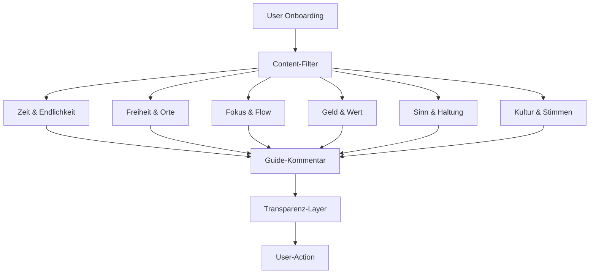
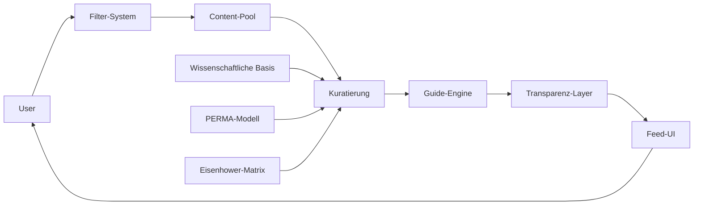
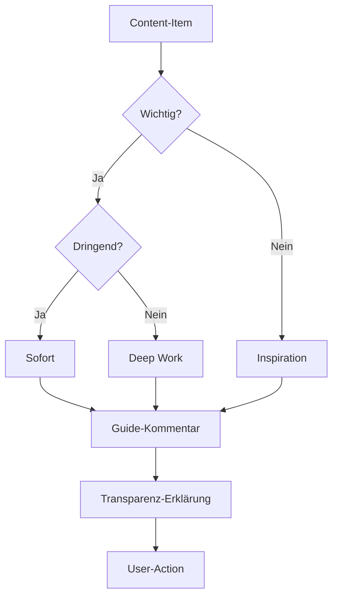
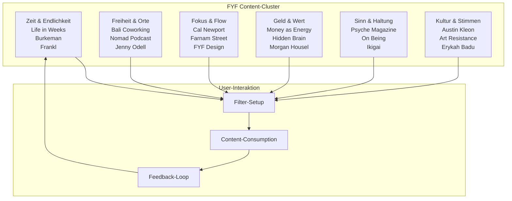
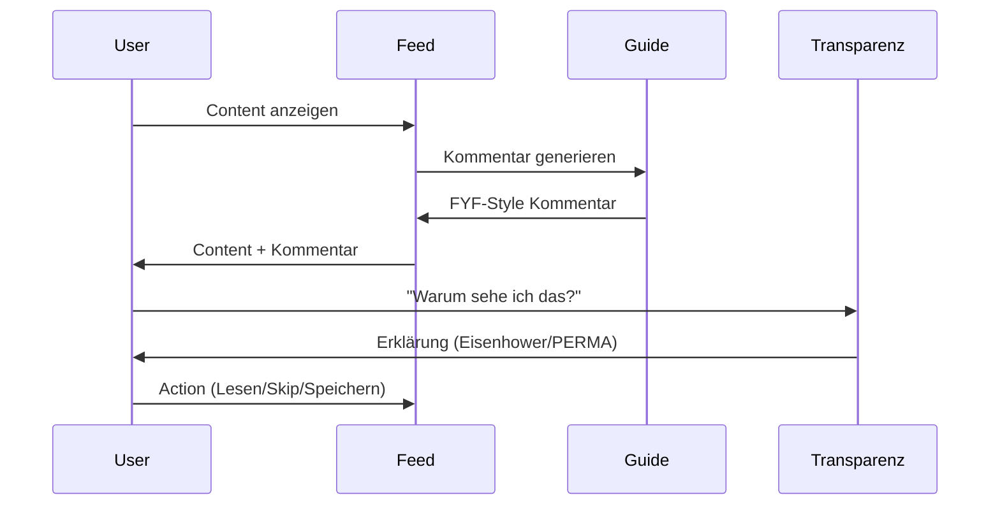
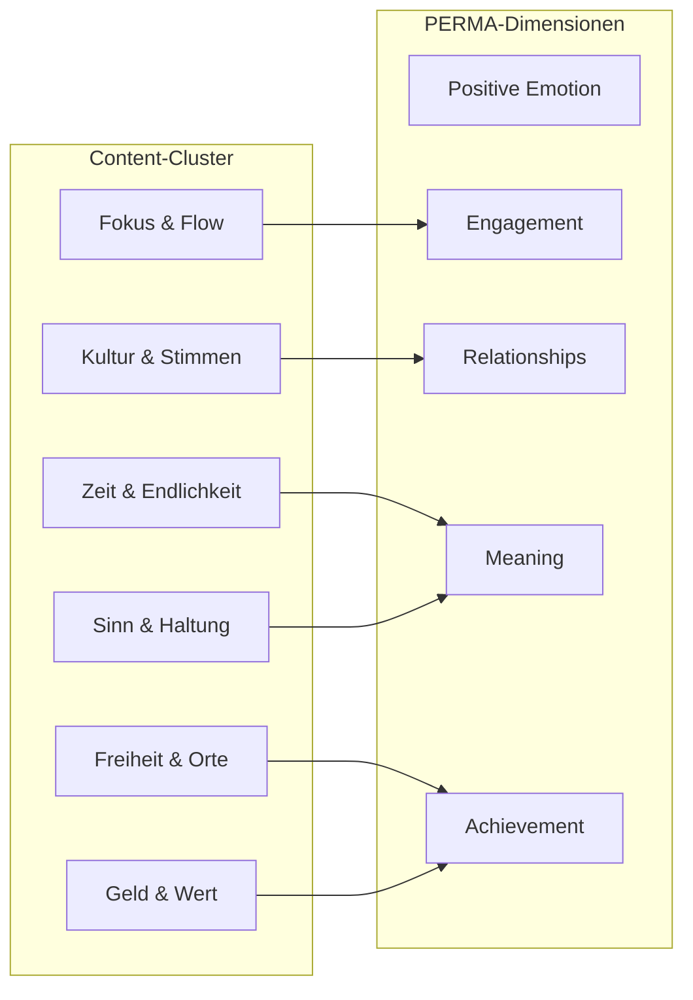

# Diagramm-Layouter für Flow/Mermaid

**Titel:** Diagramm-Layouter für Flow/Mermaid  
**Typ:** Visualisierung  
**Zweck:** Visual-Logik für Cluster/Architektur-Kopplung  

---

## Prompt

Erzeuge ein Mermaid-Diagramm, das die Verbindungen zwischen den 6 FYF-Content-Clustern, UI-Rollen und Guide-Kommentaren darstellt (mit Labels/Kuratorpfad erreichbar).

---

## Diagramm-Typen

### 1. Content-Cluster-Flow


### 2. System-Architektur


### 3. Content-Entscheidungsbaum


---

## Mermaid-Templates

### Content-Cluster-Übersicht


### Guide-Kommentar-System


### PERMA-Integration


---

## Diagramm-Generierung-Prompts

### Für Content-Flow
```
Erstelle ein Mermaid-Diagramm für den FYF-Content-Flow:
1. User startet mit Onboarding
2. Setzt Filter (Format, Themen, Limits)
3. Content wird nach 6 Clustern gefiltert
4. Guide kommentiert jeden Content
5. Transparenz-Layer erklärt Auswahl
6. User interagiert (Lesen/Skip/Speichern)
7. Feedback fließt zurück in System

Stil: Klar, minimalistisch, fokussiert auf User-Autonomie
```

### Für System-Architektur
```
Visualisiere die FYF-System-Architektur:
- User als Zentrum
- Filter-System als Kontrollschicht
- Content-Pool als Datenquelle
- Kuratierung als Qualitätsfilter
- Guide-Engine als Kommentar-Generator
- Transparenz-Layer als Erklärungsmodul
- Feed-UI als Präsentationsschicht

Zeige: Datenfluss, Entscheidungspunkte, Feedback-Loops
```

### Für Content-Entscheidungen
```
Erstelle einen Entscheidungsbaum für Content-Kategorisierung:
- Start: Content-Item
- Kriterium 1: Wichtig? (Ja/Nein)
- Kriterium 2: Dringend? (Ja/Nein)
- Ergebnis: Eisenhower-Kategorien
- Folge: Guide-Kommentar-Style
- Ende: Transparenz-Erklärung

Stil: Logisch, nachvollziehbar, transparent
```

---

## Visual-Requirements

### Design-Prinzipien
- **Minimalistisch:** Weniger ist mehr
- **Klar:** Jeder Pfeil hat Bedeutung
- **Transparent:** Entscheidungen sichtbar
- **User-zentriert:** User im Mittelpunkt

### Farb-Coding
- **Blau:** User-Aktionen
- **Grün:** Content-Cluster
- **Orange:** Guide-System
- **Grau:** System-Komponenten
- **Rot:** Entscheidungspunkte

### Labeling
- **Kurze Labels:** Max. 3 Wörter
- **Klare Pfeile:** Richtung eindeutig
- **Gruppierungen:** Logische Clusters
- **Legende:** Farb-/Symbol-Erklärung

---

## Export-Formate

### Mermaid-Live
- Direkt in Mermaid-Live-Editor
- Export als PNG/SVG
- Embedding in Dokumentation

### Notion-Integration
- Mermaid-Blocks in Notion
- Interaktive Diagramme
- Kollaborative Bearbeitung

### GitHub-Integration
- Mermaid in README.md
- Automatische Rendering
- Versionierung

---

**Status:** Template bereit für Diagramm-Generierung  
**Nächste Schritte:** Prompts ausführen, Diagramme erstellen, in Dokumentation integrieren
